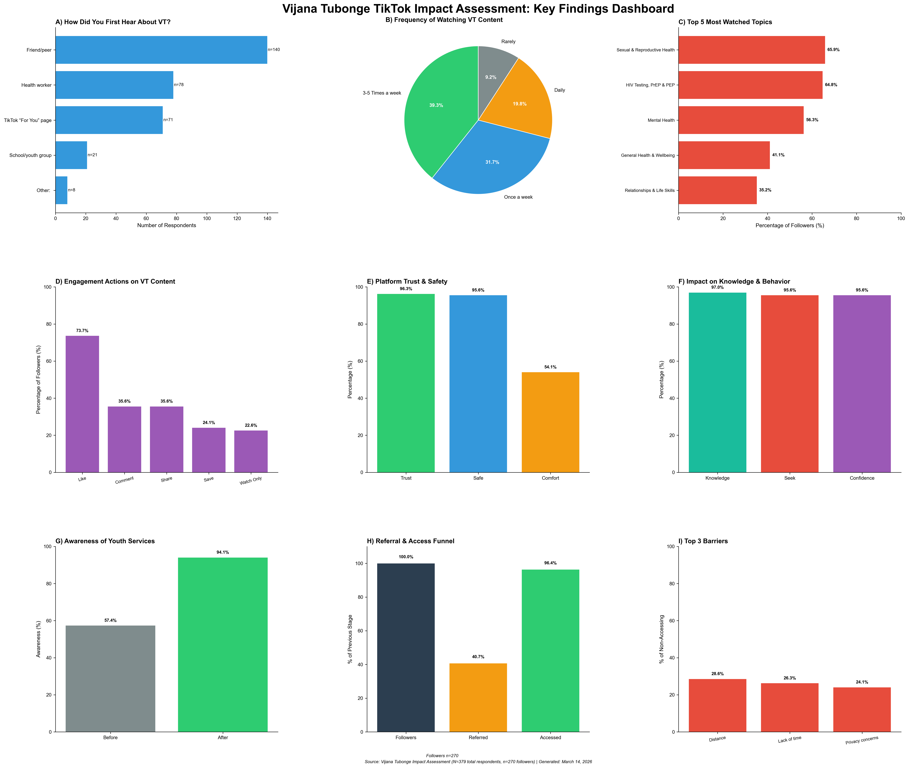

# Vijana Tubonge: TikTok, Youth Health Engagement & Service Referral

> **From social-media engagement to service access: a reproducible Python analysis of a youth digital-health survey in Machakos County, Kenya.**

[](https://www.python.org/)
[](https://pandas.pydata.org/)
[]()
[]()



## Why this project matters

Young people increasingly encounter health information on platforms built for entertainment rather than health programming. The analytical question is therefore bigger than **“Did people watch the content?”**

This project follows the user journey:

**Reach → Follow → Engage → Trust → Learn → Seek services → Access services**

Using survey data from **379 respondents**, the analysis translates questionnaire responses into decision-ready evidence about:

- who the platform reached;
- how frequently young people engaged with it;
- which health topics resonated;
- whether users perceived the information as trustworthy and safe;
- whether users reported changes in knowledge and confidence; and
- how digital referrals translated into reported service access.

The repository is designed as a portfolio piece demonstrating **research thinking, MEL discipline, quantitative analysis, data-quality awareness, visual communication, and reproducibility**.

---

## Executive takeaways

| Signal | Finding | Why it matters |
|---|---:|---|
| **Awareness** | **83.9%** (318/379) | Strong platform recognition within the survey sample |
| **Followership** | **84.9%** (270/318) | High conversion from awareness to following |
| **Frequent viewing** | **38.1%** watch 3–5×/week | Suggests sustained exposure among followers |
| **Trust** | **96.3%** | Credibility is a major asset for health communication |
| **Knowledge** | **97.0%** agree/strongly agree knowledge increased | Strong self-reported educational value |
| **Referral** | **40.7%** received a service referral | Shows a pathway beyond content consumption |
| **Service access** | **96.4%** of referred followers accessed services | Referral pathway appears operationally promising |
| **Access experience** | **100%** rated the accessed service helpful/very helpful | Strong reported experience among those reaching services |

**The strongest story is not a single percentage. It is the pathway:** 270 followers → 110 reported referrals → 106 reported service access.

> **Important:** These are descriptive, self-reported findings from a cross-sectional survey. They should not be interpreted as causal estimates of TikTok's effect.

---

## Research question

**How does the Vijana Tubonge TikTok platform reach, engage and support young people to learn about and access health services?**

### Analytical objectives

1. **Reach & engagement** — understand awareness, followership and viewing frequency.
2. **Content exposure** — identify the health topics and formats attracting attention.
3. **Trust & safety** — assess perceived credibility, comfort and safety.
4. **Perceived influence** — examine self-reported knowledge, confidence and service-seeking.
5. **Referral pathway** — quantify referral and reported service access.
6. **Access barriers** — identify practical barriers affecting service utilisation.

---

## The analysis journey

### 01 — Reach

**379 respondents → 318 aware → 270 followers**

Awareness was high in the survey sample, while followership was also strong among those who knew the platform.

### 02 — Engagement

Among followers:

- **38.1%** watched 3–5 times per week.
- **19.3%** watched daily.
- The most prominent content interests were **SRHR (65.9%)**, **HIV testing/PrEP/PEP (64.8%)**, and **mental health (56.3%)**.

### 03 — Trust and safety

- **96.3%** reported trusting the health information.
- **95.6%** felt safe and respected.
- **91.9%** were comfortable or very comfortable asking health questions.

### 04 — Perceived learning and behaviour

- **97.0%** agreed or strongly agreed that the platform increased their health knowledge.
- **95.6%** said the content encouraged them to seek services when needed.
- **95.6%** reported greater confidence making health decisions.

### 05 — Referral to services

The most actionable operational result is the referral funnel:

**270 followers → 110 referred (40.7%) → 106 accessed (96.4% of referred)**

All 106 respondents who reported accessing a referred service rated that service **helpful or very helpful**.

---

## What I would tell a programme manager

### Keep investing in:
- **SRHR and HIV content**, which show strong audience interest.
- **Mental-health content**, which also attracts substantial attention.
- **Peer-led discovery**, given the importance of friend/peer recommendations.
- **Referral pathways**, because the analysis shows a clear link between digital engagement and reported service navigation.

### Investigate next:
- Why some followers do not progress from content exposure to referral.
- Whether distance, time, privacy or stigma are creating drop-off in the referral pathway.
- Which content formats generate the strongest engagement and subsequent service-seeking.
- Whether outcomes differ by age, sex, residence or current status.
- Whether platform analytics can be linked to survey responses in a future evaluation.

---

## Methodology

### Design
Cross-sectional survey analysis using structured questionnaire data.

### Sample
**n = 379** survey respondents.

Primary platform cohort:

**n = 270 followers**, used for most engagement, perception, knowledge and referral indicators.

### Referral denominator

The referral pathway uses conditional denominators:

- **270** followers
- **110** reported receiving a referral
- **106/110** reported accessing a referred service
- **106/106** rated the accessed service helpful/very helpful

### Analytical approach

The workflow includes:

- data loading and validation;
- cohort construction;
- frequency and proportion calculations;
- multiple-response analysis;
- conditional referral-funnel analysis;
- indicator-level numerator/denominator documentation;
- automated CSV output for key indicators; and
- visual communication through a consolidated dashboard.

---

## A note on analytical integrity

A previous version of the project used the word **“impact”** broadly. This repository deliberately uses **“reach”, “engagement”, “perceived influence” and “reported service access”** instead.

Why?

Because the underlying design is **cross-sectional and self-reported**. It can describe associations and user-reported experiences, but it cannot establish that the TikTok platform caused the observed changes.

The “before vs after” awareness comparison is also **retrospective**, so recall and response bias are possible.

That distinction is important in real-world MEL and research work: **credible analysis should be willing to say what the data cannot prove.**

---

## Data-quality note

The workbook contains respondents in age bands above 24, including **25–29, 30–34, 35–39 and above 39**. Because the project narrative describes adolescents and young people aged 10–24, the eligibility criteria should be reconciled with the original study protocol before the age-specific findings are presented publicly.

See [`docs/data_quality_and_interpretation.md`](docs/data_quality_and_interpretation.md).

---

## Repository structure

```text
.
├── assets/
│   └── portfolio_card.png
├── data/
│   └── README.md
├── docs/
│   └── data_quality_and_interpretation.md
├── outputs/
│   ├── dashboard.png
│   ├── executive_summary.md
│   └── key_indicators.csv
├── src/
│   └── analyze.py
├── .gitignore
├── LICENSE
├── README.md
├── requirements.txt
└── run_analysis.bat
```

### Why the raw dataset is not in the public repository

The source workbook contains respondent-level survey records. Even when obvious identifiers are absent, individual-level health and demographic responses deserve careful handling.

**Do not publish the raw workbook unless the data owner, consent framework and applicable ethics/data-protection requirements explicitly allow it.**

The code is designed to run locally against an approved copy of the workbook.

---

## Run it locally

### 1. Clone the repository

```bash
git clone https://github.com/YOUR-USERNAME/vijana-tubonge-tiktok-analysis.git
cd vijana-tubonge-tiktok-analysis
```

### 2. Create an environment

```bash
python -m venv .venv
```

Windows:

```bash
.venv\Scripts\activate
```

macOS/Linux:

```bash
source .venv/bin/activate
```

### 3. Install dependencies

```bash
pip install -r requirements.txt
```

### 4. Add the approved data file

Place the approved workbook in `data/` using the filename documented in `data/README.md`.

### 5. Run the analysis

```bash
python src/analyze.py
```

Windows users can also run:

```text
run_analysis.bat
```

The script writes a refreshed `outputs/key_indicators.csv`.

---

## Skills demonstrated

**Research & MEL**
- Indicator definition and denominator discipline
- Survey-data interpretation
- Referral-funnel analysis
- Programme-oriented recommendations
- Data-quality and limitation assessment

**Quantitative analysis**
- Python
- pandas
- Excel
- Frequency and proportion analysis
- Multiple-response indicators
- Conditional denominators

**Data storytelling**
- Executive summaries
- Dashboard design
- Decision-focused visualisation
- Translating findings into programme actions

**Analytical judgement**
- Distinguishing association from causality
- Identifying denominator problems
- Recognising sample/eligibility inconsistencies
- Treating missingness as an analytical issue rather than silently ignoring it

---

## Portfolio positioning

This project is intentionally more than a charting exercise.

It demonstrates how I approach evidence work in practice:

> **Start with the programme question. Build a defensible analytical pathway. Make denominators explicit. Test the story against the data. Communicate what matters. And be clear about what the evidence cannot prove.**

That is the difference between producing numbers and producing **decision-useful evidence**.

---

## Suggested GitHub description

**Python-based analysis of youth engagement, health-information trust and digital referral pathways through the Vijana Tubonge TikTok platform in Kenya.**

### Suggested repository topics

`python` `pandas` `data-analysis` `digital-health` `youth-health` `MEL` `M&E` `research` `survey-analysis` `data-visualization` `Kenya` `public-health`

---

## Author

**Victor Otieno Opiyo**  
Evidence, Learning & Insights | MEL | Applied Research | Data Analytics  
Nairobi, Kenya

[LinkedIn](https://linkedin.com/in/victor-opiyo)

